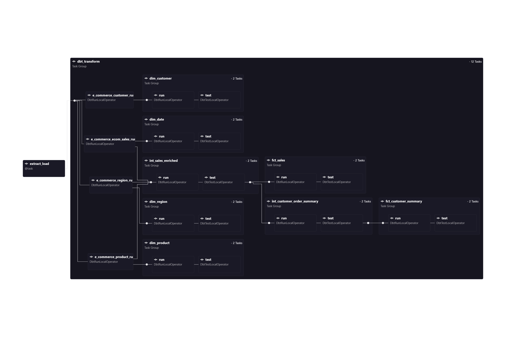
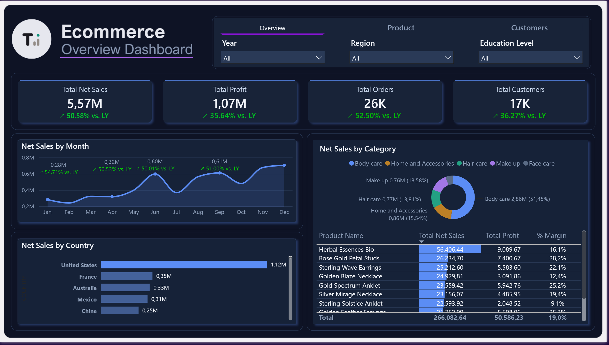
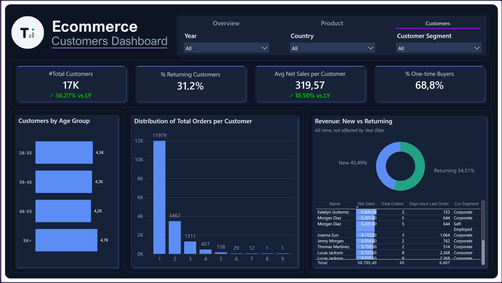
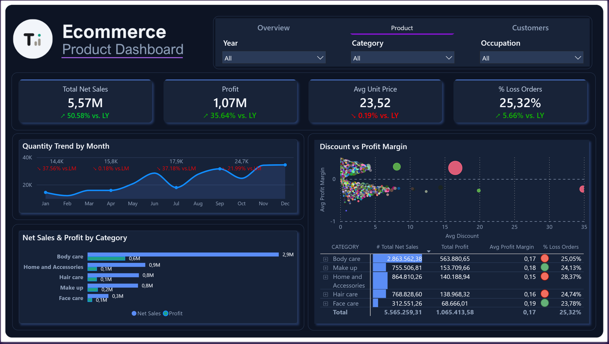

# Xom Ecommerce Data Pipeline

End-to-end data pipeline cho dữ liệu ecommerce: từ SQL Server (OLTP) đến dashboard Power BI, tự động hóa hoàn toàn bằng Airflow.

**Đích đến:** SQL Server → dlt → Snowflake → dbt → Airflow (Docker/Astro) → Power BI

## Architecture

```
SQL Server (e_commerce)
        │  dlt (Python) — Extract + Load
        ▼
Snowflake  ecommerce_db.e_commerce   (raw)
        │  dbt — Transform
        ▼
Snowflake  ecommerce_db.dev          (staging → intermediate → marts)
        │
        ▼
     Power BI  (Import mode, star schema)
```

Toàn bộ pipeline chạy tự động mỗi ngày qua **Airflow** (Astro Runtime, Docker), điều phối 2 bước: `extract_load` (dlt) rồi `dbt_transform` (dbt qua Cosmos, mỗi model + test là 1 task riêng).

Ví như một nhà máy nước: SQL Server là cái giếng, dlt là máy bơm hút nước thô lên bồn chứa Snowflake, dbt là nhà máy lọc biến nước thô thành nước sạch, Airflow là công tắc hẹn giờ tự vận hành mỗi ngày, và Power BI là vòi nước cuối cùng — mở dashboard là thấy dữ liệu sạch.

## Stack

| Layer | Tool | Vai trò |
|---|---|---|
| Source | SQL Server | Dữ liệu OLTP gốc, schema `e_commerce` |
| Extract + Load | [dlt](https://dlthub.com/) (Python) | Hút toàn bộ 4 bảng nguồn, ghi vào Snowflake (full load, idempotent) |
| Warehouse | Snowflake | Raw (`e_commerce`) + Clean (`dev`) |
| Transform | dbt (dbt-snowflake) | staging → intermediate → marts, kèm tests |
| Orchestration | Airflow (Astro Runtime 3.x) + Docker + Cosmos | Chạy `extract_load` rồi `dbt_transform` tự động mỗi ngày |
| BI | Power BI (Import mode) | 3 dashboard: Overview, Product, Customers |

## Data model

### Nguồn (`e_commerce`, SQL Server)

| Bảng | Vai trò | PK |
|---|---|---|
| `ecom_sales` | Fact — 1 dòng = 1 sản phẩm trong 1 đơn | `row_id` |
| `customer` | Dim khách hàng | `customer_id` |
| `product` | Dim sản phẩm | `product_code` |
| `region` | Dim địa lý | `region_code` |

### dbt — 3 lớp

```
staging (view)              đổi tên cột + làm sạch mã, KHÔNG join
intermediate (table)        join dim + tính chỉ số phái sinh
marts (table)                star schema cho Power BI
├── dimension/  dim_customer, dim_product, dim_region, dim_date
└── fact/       fct_sales, fct_customer_summary
```

**Star schema** trong Power BI — 2 fact chia sẻ `dim_customer` (conformed dimension):

```
                    ┌── dim_date
                    │
dim_customer ──┬── fct_sales ──── dim_product
                │        │
                │        └──── dim_region
                │
                └── fct_customer_summary
```

- **`fct_sales`** — grain: 1 dòng = 1 sản phẩm trong 1 đơn. 5 chỉ số phái sinh tính sẵn ở dbt (`net_sales`, `profit_margin`, `unit_price`, `discount_amount`, `is_profitable`) — Power BI chỉ hiển thị, không viết DAX phức tạp.
- **`fct_customer_summary`** — grain: 1 dòng = 1 khách hàng. Tổng hợp hành vi mua (`total_orders`, `days_since_last_order`, `is_returning_customer`) tính trên toàn bộ lịch sử, không gắn theo năm — có chủ đích, không làm RFM scoring.

Toàn bộ pipeline có **10 test dbt** (source-level `unique`/`not_null`, `relationships` giữa fact và dim, và 5 singular test nghiệp vụ: quantity dương, discount trong khoảng hợp lệ, net_sales ≤ sales, profit_margin hợp lý, order_date không ở tương lai).

## Airflow DAG

`ecommerce_elt_dag` chạy `0 2 * * *` UTC (9h sáng giờ VN) mỗi ngày, `catchup=False`, `max_active_runs=1`. Cosmos `DbtTaskGroup` tách mỗi model dbt + test thành task riêng, thấy được model nào fail và lineage ngay trên UI.



## Power BI Dashboard

3 trang, cùng tông dark/tech, mỗi trang trả lời đúng vài câu hỏi kinh doanh cốt lõi thay vì nhồi hết mọi chỉ số:

- **Overview** — sức khỏe kinh doanh tổng quan: doanh thu, lợi nhuận, số đơn, xu hướng theo tháng, theo quốc gia.
- **Product** — category/sản phẩm nào đang gánh doanh thu, category nào lời/lỗ, quan hệ discount vs profit margin.
- **Customers** — nhân khẩu học, khách mới vs khách quay lại, phân bố số lần mua hàng, top khách hàng.

▶ [Xem dashboard trực tiếp](https://app.powerbi.com/view?r=eyJrIjoiOTAwYjNmMjYtZjRmNS00Y2I0LTgxMjYtZjYxYjNkNzhmZWRkIiwidCI6IjM3MGZiM2I4LTMzMDYtNDg5MC05MDYzLWNjMDhiZTc4ODI1NyIsImMiOjEwfQ%3D%3D)





## How to run

### 1. Extract + Load (dlt)

```bash
cd el
python -m venv venv && source venv/bin/activate
pip install -r ../requirements-el.txt
# điền credentials vào .dlt/secrets.toml (SQL Server + Snowflake)
python pipeline_ecommerce_v1_fullload.py
```

### 2. Transform (dbt)

```bash
cd dbt_ecommerce
python -m venv venv && source venv/bin/activate
pip install -r requirements-dbt.txt
dbt deps
dbt run
dbt test
dbt docs generate && dbt docs serve   # xem lineage graph
```

### 3. Orchestration (Airflow, Docker)

```bash
curl -sSL install.astronomer.io | sudo bash -s
cd airflow
# điền credentials vào .env và airflow_settings.yaml (xem template trong code)
astro dev start   # UI tại localhost:8080
```

Trigger DAG `ecommerce_elt_dag` thủ công hoặc đợi lịch chạy tự động `02:00 UTC` hằng ngày.

### 4. Power BI

Get Data → Snowflake, Import mode, chỉ chọn bảng `fct_*`/`dim_*` trong schema `dev`.

**Credentials không được commit** — `.env`, `secrets.toml`, `airflow_settings.yaml` đều nằm trong `.gitignore`.

## What I learned

- **`SALES` trong bảng nguồn là giá gốc CHƯA trừ discount**, không phải doanh thu thực nhận — phải verify bằng cách so `unit_price` cùng `product_code` ở các mức discount khác nhau (không đổi) mới phát hiện ra, rồi tính riêng `net_sales = sales * (1 - discount)` ở tầng intermediate.
- **Mã `region_code`/`product_code` bị lặp prefix** (kiểu `RR0001`) ở một số dòng — phải `REGEXP_REPLACE` làm sạch ngay tại staging, nếu không sẽ gãy join với dimension một cách âm thầm. Rủi ro đánh đổi: nếu nguồn tồn tại đồng thời `R001` và `RR001`, sau khi clean sẽ trùng nhau — test `relationships` ở `fct_sales` là lưới an toàn cuối cùng để bắt lỗi này.
- **Chủ động bỏ RFM scoring.** Thay vì chấm điểm/gán nhãn khách hàng, `fct_customer_summary` chỉ tổng hợp hành vi thô (`total_orders`, `days_since_last_order`, `is_returning_customer`) — đơn giản, đủ dùng, không thêm logic nghiệp vụ cần diễn giải.
- **Cosmos cần `InvocationMode.SUBPROCESS` ở cả `ExecutionConfig` lẫn `RenderConfig`** — vì dbt chạy trong venv riêng với Airflow (tránh xung đột dependency). Mặc định Cosmos dùng `DBT_RUNNER`, đòi dbt cài chung môi trường với Airflow, sẽ raise lỗi ngay lúc parse DAG nếu không set đúng cả 2 chỗ.
- **`fct_customer_summary` không có cột ngày nối vào `dim_date`** — một quyết định thiết kế đúng grain (1 dòng = 1 khách hàng, tổng hợp *toàn bộ* lịch sử), nhưng hệ quả là các chỉ số như `is_returning_customer` không thể lọc theo năm trong Power BI. Chấp nhận giới hạn này thay vì ép thêm ngày vào bảng — làm vậy sẽ hạ grain và phá vỡ đúng ý nghĩa "quay lại hay không" của cột đó.

## Cấu trúc repo

```
xom-ecommerce-data-pipeline/
├── el/                    # Extract + Load (dlt)
├── dbt_ecommerce/         # Transform (dbt) — staging, intermediate, marts, tests
├── airflow/               # Orchestration (Astro project, Docker)
└── docs/
    └── schema_dump.txt    # Khảo sát schema nguồn SQL Server
```
